## A little about me

Website: [gdalle.github.io](https://gdalle.github.io/)

::: {.columns}

::: {.column}
### CV
- 2019-2022: PhD at ENPC
- 2022: visiting student at MIT
- 2023-2024: postdoc at EPFL
- 2025-: researcher at ENPC
:::

::: {.column}
### Research topics
- Operations research
- Machine learning
- High-performance computing
:::

:::

## ACME project

- _Approvisionnement Collaboratif Multimodal Ecologique_: unlocking horizontal collaboration in the supply chain
- 3 disciplines: mathematics, computer science, economics
- 4 universities (ENPC, TSE, Inria, IMB) with budget to recruit 6 PhD students, 2 postdocs, 2 research engineers
- Industrial partners: Califrais, AI Cargo Foundation, Renault and others

## Slides

Available at [gdalle.github.io/CalifraisWorkshop2026](https://gdalle.github.io/CalifraisWorkshop2026/)

# Optimization as a subroutine

## Multi-agent pathfinding

{fig-align="center"}

## Traffic equilibrium

<iframe title="vimeo-player" src="https://player.vimeo.com/video/319314052?h=d8b5861303" width="840" height="460" frameborder="0" referrerpolicy="strict-origin-when-cross-origin" allow="autoplay; fullscreen; picture-in-picture; clipboard-write; encrypted-media; web-share"   allowfullscreen></iframe>

## Decision-focused learning

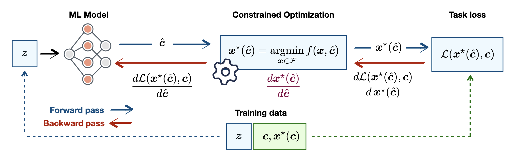{fig-align="center"}

## Bilevel programming

$$
\begin{aligned}
\min_{x, y} ~ & F(x, y) \\
\mathrm{s.t.} ~ & G(x, y) \geq 0 \\
& y \in \arg\min_y ~\{f(x, y): g(x, y) \geq 0\}
\end{aligned}
$$

## Common aspects of subroutines

- Executed many times in parallel
- Executed many times in a sequence
- Executed many many times on the same instance
- High precision is not crucial

## Potential for parallelism

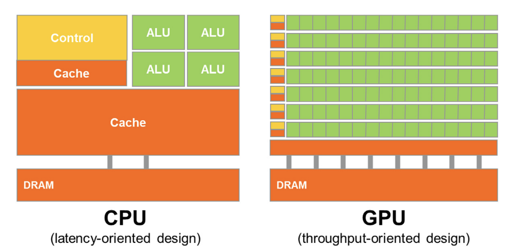{fig-align="center"}

# Shortest path algorithms

## Bellman-Ford

- Dynamic programming: update the distance estimate from $s$ to $v$ using at most $k$ steps
$$
d_k(s, v) = \min_{u \in N(v)} \{d_{k-1}(s, u) + w(u, v)\}
$$
- Complexity: $O(E V)$ (slow!).

## Dijkstra

- Dynamic programming: update the distance estimate from $s$ to $v$ from closest to furthest vertex.
- Uses a priority queue (or heap) to keep track.
- Complexity: $O(E + V \log V)$ (fast!)

## A*

- Same as Dijkstra, but change the priorization: from most promising to least promising vertex.
- Complexity: depends on the chosen heuristic.

## Good on CPU, bad on GPU

- Dijkstra and A* are heavily sequential
- They make use of complex storage structures
- Graph data is sparse and irregular

# Sparse linear algebra for parallel shortest paths

## Graphs are matrices

::: {.columns}
::: {.column}
Adjacency matrix:

$$
A_{u, v} = \begin{cases}
1 & \text{if $v \in N(u)$} \\
0 & \text{otherwise}
\end{cases}
$$
:::
::: {.column}
Incidence matrix:
$$
B_{e, v} = \begin{cases}
1 & \text{if $e = \{u, v\}$} \\
0 & \text{otherwise}
\end{cases}
$$
:::
:::

## Neighborhoods are multiplications

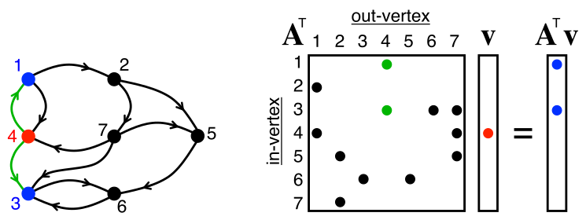{fig-align="center"}

## The GraphBLAS standard

- Goal: express graph primitives in the language of linear algebra (same as BLAS).
- Uses custom semirings for algebraic operations.
- Allows easy expression of sophisticated algorithms like Bellman-Ford.

## Sparse matrix formats - COO, CSR

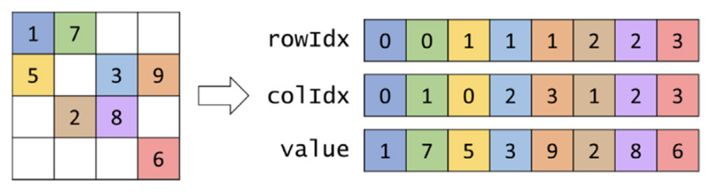{fig-align="center"}
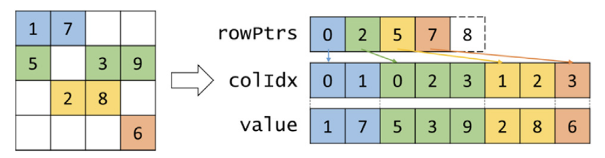{fig-align="center"}

## Matrix-vector products on GPU

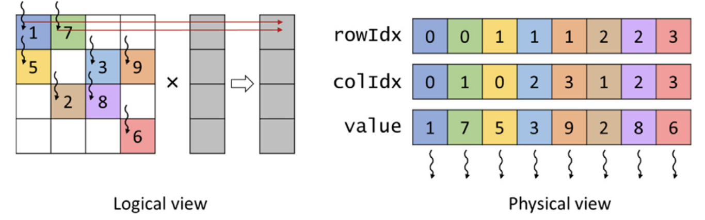{fig-align="center"}
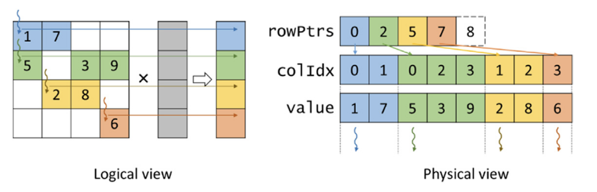{fig-align="center"}

## Better formats? ELL

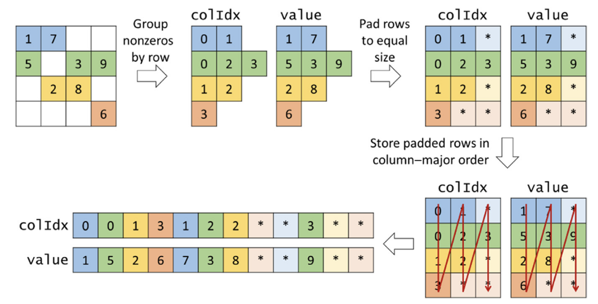{fig-align="center"}

## Better formats? ELL (2)

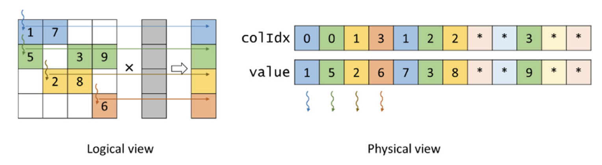{fig-align="center"}

## Even better formats?

Adapt to the data at hand!

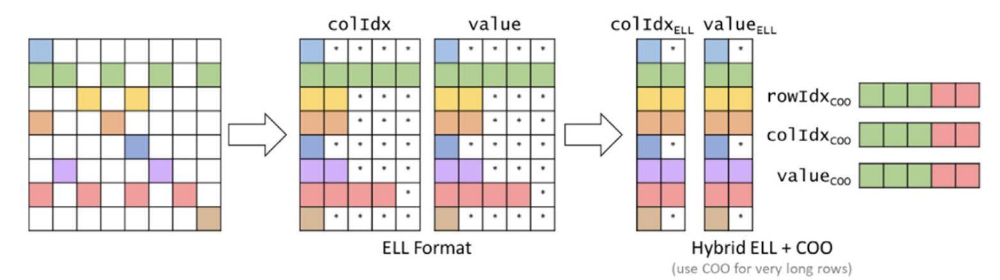{fig-align="center"}

# Preprocessing for parallel shortest paths

## One graph, many queries

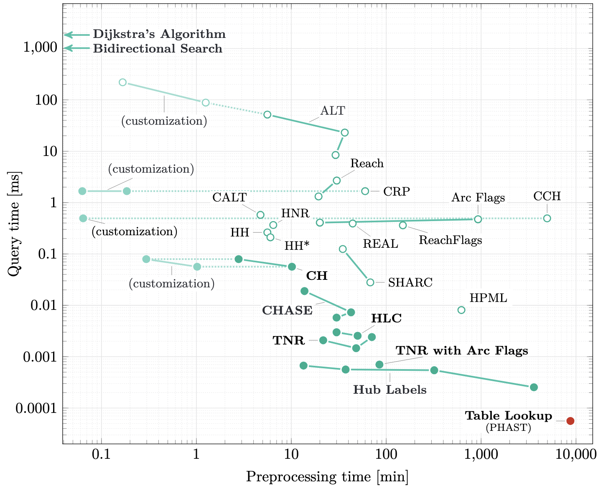{fig-align="center"}

## Contraction hierarchies

::: {.columns}
::: {.column}
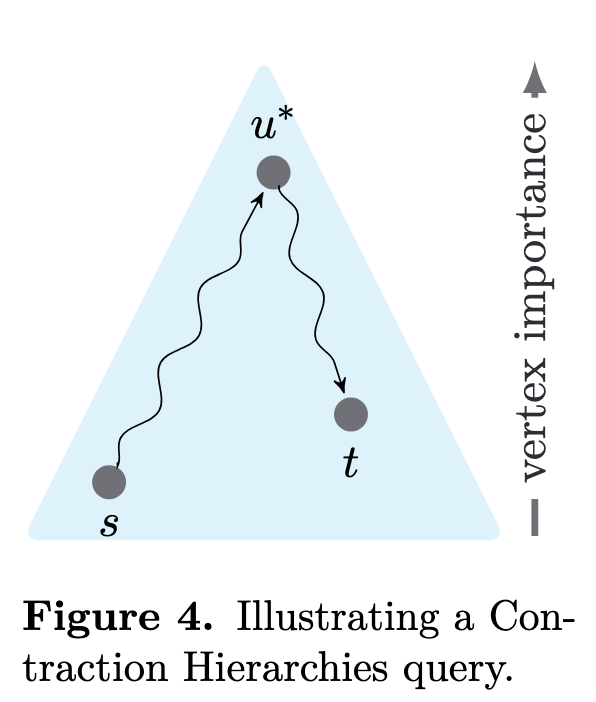{fig-align="center"}
:::
::: {.column}
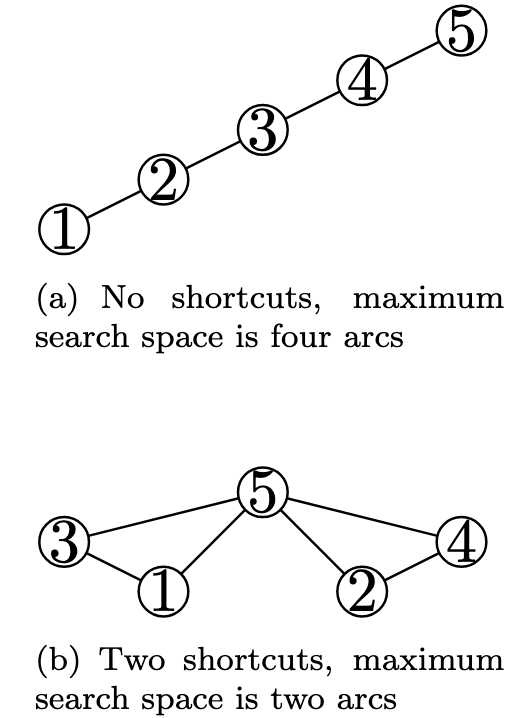{fig-align="center" width=80%}
:::
:::

## PHAST

- Tricks to speed up contraction hierarchies:
  - Reduce problem to directed acyclic graph
  - Reorder vertices to improve memory locality
- Tricks to run it on GPU:
  - Process topological levels in parallel
  - Process several shortest path trees at once

## Customizable contraction hierarchies

- Tricks to update the contraction hierarchy when weights change
- Contract vertices in a weight-agnostic way

## Other settings

- Railway networks
- Multimodal city networks
- Time-dependent networks

# Challenges ahead

## Algorithmic decisions

::: {.columns}
::: {.column}
- Preprocessing time vs query time
- Theoretical complexity doesn't tell the whole story
:::
::: {.column}
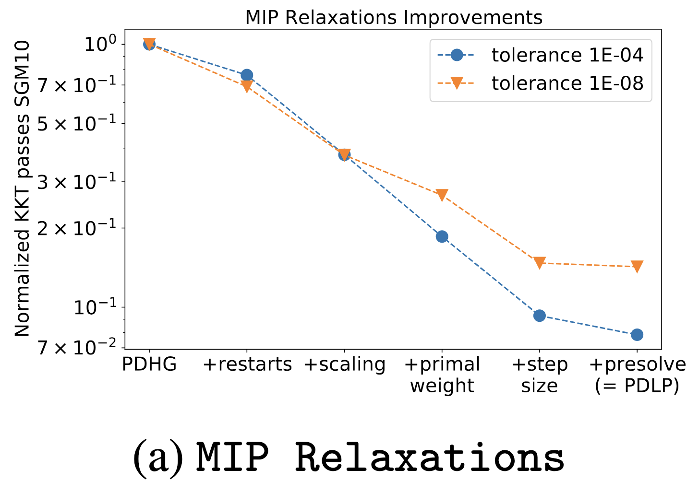{fig-align="center"}
:::
:::

## Hardware-agnostic code

- How to run on every platform?
- Write portable "kernels" with [KernelAbstractions.jl](https://github.com/JuliaGPU/KernelAbstractions.jl)
- Combine CPU and GPU

## Role of LLMs

- Easier to write GPU kernels or implement algorithms from papers
- Code generation is no longer a bottleneck
- Ensuring correctness is the new frontier

## Software funding and maintenance

- Research software developers are more relevant than ever
- Requires mathematical and computer science expertise
- Undervalued activity in our research ecosystem

## References

---
nocite: |
  @*
---

::: {#refs}
:::